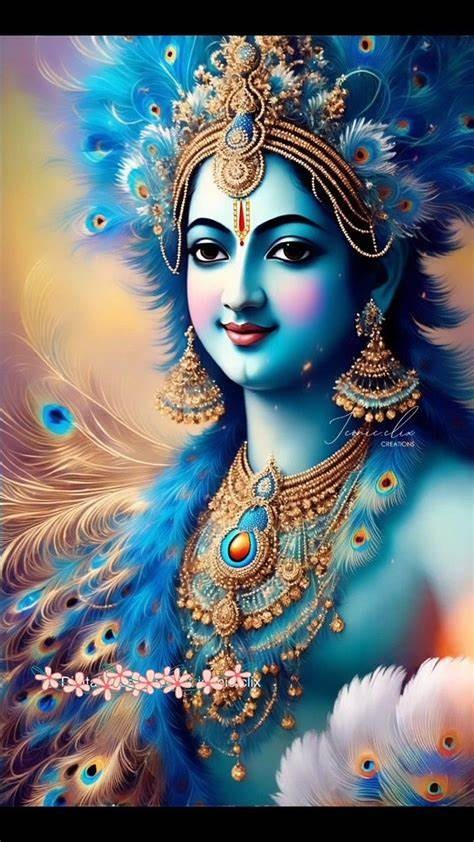

# Image to Pencil Sketch Converter 🖼️✏️

Convert photos into realistic pencil sketches with a desktop GUI built in Python (Tkinter) and OpenCV.  
This app produces natural-looking lines and shading, suitable for fun edits or demo projects.

---

## ✨ Features
- Convert any photo to a pencil sketch effect  
- Dark sketch option, vintage filter, grayscale, brightness adjustment  
- Undo, save, zoom, and pan features  
- Works fully offline with Python  

---

## 📸 Demo
Input vs Sketch Example:  

| Original Image | Pencil Sketch |
|----------------|---------------|
|  |  |

---

## ⚙️ Requirements
- Python 3.8+  
- Install dependencies:
  ```bash
  pip install opencv-python Pillow numpy
- tkinter (usually comes with Python; install separately if missing):
  ```bash
  sudo apt install python3-tk    # Linux (Debian/Ubuntu)

---

## 🚀 Run the Project
- Clone the repo:
  ```bash
  git clone https://github.com/pavana-namburi/Image-editor
  cd image-editor
